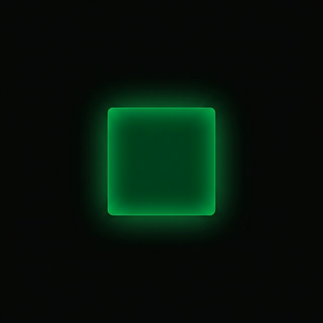

# 🌿 CommitGlow

**Subtle, glassmorphic GitHub contribution heatmap for your New Tab.**

CommitGlow is a minimalist Chrome Extension (Manifest V3) that injects a glowing GitHub contribution heatmap directly onto your `chrome://newtab` or `about:blank` page. Designed for motivation and aesthetic purity, it reminds you of your progress without overwhelming your screen.

  

---

## ✨ Features

- **Shadow DOM Isolation**: Runs in its own isolated environment — won't break your page's CSS.
- **Dark, Sleek Aesthetic**: Semi-transparent dark panel with glassmorphism (backdrop-blur) and GitHub green accents.
- **Toggle via Icon**: Click the extension icon in your toolbar to instantly show or hide the widget.
- **Persistent State**: Remembers your preferred visibility across sessions.
- **Auto-Fallback**: Silently switches to a high-quality static chart if library loading fails.
- **Responsive**: Adapts gracefully to different screen sizes.

## 🚀 Installation (Load Unpacked)

1. **Clone/Download** this repository.
2. Open Chrome and navigate to `chrome://extensions/`.
3. Enable **Developer Mode** (top-right toggle).
4. Click **Load unpacked** and select the folder where you saved this project.
5. Open a new tab (`about:blank` or your preferred NTP) and watch the glow ignite!

---

## 🛠️ Roadmap & Improvement Plan

We're just getting started. Here’s what’s on the horizon for CommitGlow:

### 1. **Dynamic Configuration (v1.1)**
- [ ] **Username Input**: Add an options page to change the GitHub username without editing code.
- [ ] **Positioning**: Switch between `Top-Center`, `Bottom-Right`, and `Left-Center`.

### 2. **Enhanced Visualization (v1.2)**
- [ ] **Color Themes**: Presets for different styles (e.g., Solarized, Nord, or High-Contrast).
- [ ] **Custom Streaks**: Visual labels for "Hottest Day" or "Month-to-Date" progress.
- [ ] **Animations**: Smooth fade-in and hover transitions for each heatmap square.

### 3. **Interactivity (v1.3)**
- [ ] **Draggable Widget**: Let users reposition the widget freely on the screen.
- [ ] **Detailed Tooltips**: Show commit counts and date on hover (powered by direct API integration).

### 4. **Reliability & Performance**
- [ ] **GitHub OAuth**: Use official API tokens for higher rate limits and private contributions.
- [ ] **Offline Cache**: Store the last fetched heatmap for instant loading next time.

---

## 📄 License
MIT License. Feel free to fork and enhance!

---

*Hand-built for Ovindu. Go ignite your glow.*
